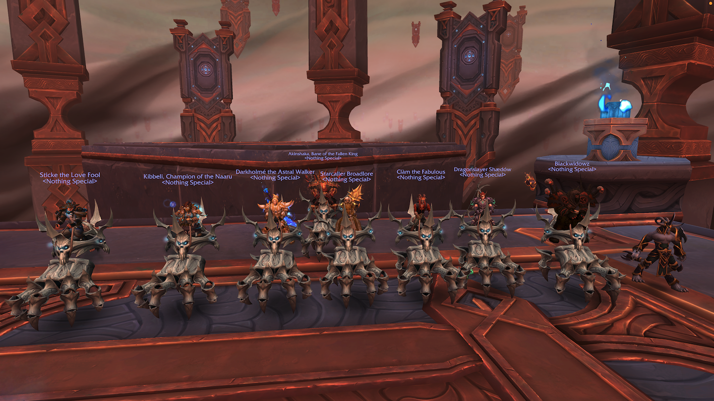

<head>
<link rel="stylesheet" type="text/css" href="css/main.css">
</head>
<body>

   

# Guild resources and documentation  

:page_with_curl: [Guild rules](/rules) 

:pound: Guild bank pricelist 

:closed_book: Meeting notes 

:crown: [Leadership structure](/leadership)

:camera: Fun images 
</body>
